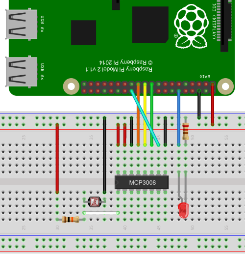
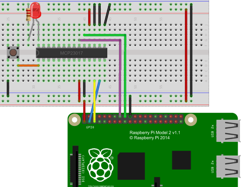

# Expansion Boards

All of these devices act as Device Factories and should be accessed as such.


## Microchip Analog to Digital Converters {: #mcp-adc }

: Provides support for the following Microchip analog-to-digital converter devices:

+ MCP300x: [MCP3001](http://www.microchip.com/wwwproducts/en/MCP3001), [MCP3002](http://www.microchip.com/wwwproducts/en/MCP3002), [MCP3004](http://www.microchip.com/wwwproducts/en/MCP3004), [MCP3008](http://www.microchip.com/wwwproducts/en/MCP3008)
+ MCP320x: [MCP3201](http://www.microchip.com/wwwproducts/en/MCP3201), [MCP3202](http://www.microchip.com/wwwproducts/en/MCP3202), [MCP3204](http://www.microchip.com/wwwproducts/en/MCP3204), [MCP3208](http://www.microchip.com/wwwproducts/en/MCP3208)
+ MCP330x: [MCP3301](http://www.microchip.com/wwwproducts/en/MCP3301), [MCP3302](http://www.microchip.com/wwwproducts/en/MCP3302), [MCP3304](http://www.microchip.com/wwwproducts/en/MCP3304)

Usage example: An LDR controlled LED (using a 10k&#8486; resistor for the LDR and a 220&#8486; resistor for the LED):



Code for the above circuit is implemented in [LdrControlledLed](https://github.com/mattjlewis/diozero/blob/master/diozero-sampleapps/src/main/java/com/diozero/sampleapps/LdrControlledLed.java), the important bit:

```java
try (McpAdc adc = new McpAdc(type, chipSelect); LDR ldr = new LDR(adc, pin, vRef, r1); PwmLed led = new PwmLed(ledPin)) {
	// Detect variations of 5%, taking a reading every 20ms
	ldr.addListener((event) -> led.setValue(1-event.getUnscaledValue()), .05f, 20);
	Logger.debug("Sleeping for 20s");
	SleepUtil.sleepSeconds(20);
}
```

*class* **com.diozero.devices.McpAdc**{: .descname } (*type*, *chipSelect*) [source](https://github.com/mattjlewis/diozero/blob/master/diozero-core/src/main/java/com/diozero/devices/McpAdc.java){: .viewcode-link } [&para;](ExpansionBoards.md#mcpadc "Permalink to this definition"){: .headerlink }

: Implementation class for all supported MCP analog-to-digital converters.

    * **type** (*McpAdc.Type*) - The MCP type (MCP3001 - MCP3304).
    
    * **chipSelect** (*int*) - SPI Chip Select to which the ADC is connected.
    
    *float* **getValue** (*adcPin*)
    
    : Get the value for the specified ADC pin. Range 0..1 (if unsigned) or -1..1 (if signed).
    
    * **adcPin** (*int*) - The pin on the MCP ADC to take a reading from.
    

## Microchip MCP23xxx GPIO Expansion Board {: #mcp-gpio-expansion-board }

An example circuit for controlling an LED with a button, all connected via an MCP23017:



Code for the above circuit is implemented in [MCP23017Test](https://github.com/mattjlewis/diozero/blob/master/diozero-sampleapps/src/main/java/com/diozero/sampleapps/MCP23017Test.java), the important bit:

```java
try (MCP23017 mcp23017 = new MCP23017(intAPin, intBPin);
		Button button = new Button(mcp23017, inputPin, GpioPullUpDown.PULL_UP);
		LED led = new LED(mcp23017, outputPin)) {
	led.on();
	SleepUtil.sleepSeconds(1);
	led.off();
	SleepUtil.sleepSeconds(1);
	led.blink(0.5f, 0.5f, 10, false);
	button.whenPressed(epochTime -> led.on());
	button.whenReleased(epochTime -> led.off());
	Logger.debug("Waiting for 10s - *** Press the button connected to MCP23017 pin {} ***",
			Integer.valueOf(inputPin));
	SleepUtil.sleepSeconds(10);
	button.whenPressed(null);
	button.whenReleased(null);
}
```

*class* **com.diozero.devices.MCP23017**{: .descname } (*controller=1*, *address=0x20*, *interruptGpioA*, *interruptGpioB=interruptGpioA*) [source](https://github.com/mattjlewis/diozero/blob/master/diozero-core/src/main/java/com/diozero/devices/MCP23017.java){: .viewcode-link } [&para;](ExpansionBoards.md#mcp23017 "Permalink to this definition"){: .headerlink }

: Provides support for the Microchip [MCP23017](http://www.microchip.com/wwwproducts/Devices.aspx?product=MCP23017) 16-bit input/output port expander. Input device state change notifications will only work if at least one of the MCP23017 interrupt pins is connected to the Raspberry Pi.

    * **controller** (*int*) - I2C bus controller to which the MCP23017 is connected to. Defaults to bus 1.
    
    * **address** (*int*) - Device I2C address. Defaults to 0x20.
    
    * **interruptGpioA** (*int*) - The pin on the Raspberry Pi to be used for input interrupt notifications for bank A. If only interruptPinA is set or interruptPinB equals interuptPinB the device will be configured to mirrored interrupt mode whereby interrupts for either bank get mirrored on both of the MCP23017 interrupt outputs.
    
    * **interruptGpioB** (*int*) - The pin on the Raspberry Pi to be used for input interrupt notifications for bank B. Defaults to interruptGpioA.
    
    *boolean* **getValue** (*gpio*)
    
    : Get the value for the specified pin.
    
    * **gpio** (*int*) - GPIO.
    
    **setValue** (*gpio*, *value*)
    
    : Set the value for the specified pin.
    
    * **gpio** (*int*) - GPIO.
    
    * **value** (*boolean*) - Value to set.


## PCF8591 ADC / DAC {: #pcf8591 }

*class* **com.diozero.devices.PCF8591**{: .descname } (*controller*=1, *address=0x40*, *inputMode*) [source](https://github.com/mattjlewis/diozero/blob/master/diozero-core/src/main/java/com/diozero/devices/PCF8591.java){: .viewcode-link } [&para;](ExpansionBoards.md#pcf8591 "Permalink to this definition"){: .headerlink }

: Supports the [NXP PCF8591](http://www.nxp.com/documents/data_sheet/PCF8591.pdf) ADC / DAC.

    * **controller** (*int*) - I2C controller.
    
    * **address** (*int*) - I2C device address.
    
    * **inputMode** (*InputMode*) - Device ADC input mode (4 single-ended, 3 differential, 2 single-ended + 1 differential, 2 differential).
    
    **getValue** (*adcPin*)
    
    : Get analogue value for the specified pin.
    
    * **adcPin** (*int*) - the analogue input pin.
    
    **setValue** (*dacPin*, *value*)
    
    : Set the analogue output value.
    
    * **dacPin** (*int*) - Digital output pin. Note there is only one DAC output pin.
    
    * **value** (*float*) - Output value (0..1).


## PCA9685 PWM / Servo Driver {: #pwm-servo-driver }

*class* **com.diozero.devices.PCA9685**{: .descname } (*controller*=1, *address=0x40*, *pwmFrequency*) [source](https://github.com/mattjlewis/diozero/blob/master/diozero-core/src/main/java/com/diozero/devices/PCA9685.java){: .viewcode-link } [&para;](ExpansionBoards.md#pca9685 "Permalink to this definition"){: .headerlink }

: Provides support for the [PCA9685](http://www.nxp.com/products/power-management/lighting-driver-and-controller-ics/i2c-led-display-control/16-channel-12-bit-pwm-fm-plus-ic-bus-led-controller:PCA9685) 12-bit 16-channel PWM driver as used by the [Adafruit PWM Servo Driver](https://www.adafruit.com/product/815). Implements [PwmOutputDeviceFactoryInterface](https://github.com/mattjlewis/diozero/blob/master/diozero-core/src/main/java/com/diozero/internal/provider/PwmOutputDeviceFactoryInterface.java) hence can be passed into the constructor of PWM output devices.

    Usage example:

    ```java
    float delay = 0.5f;
    try (PwmOutputDeviceFactoryInterface df = new PCA9685(); PwmLed led = new PwmLed(df, pin)) {
    	led.setValue(.25f);
    	SleepUtil.sleepSeconds(delay);
    	led.toggle();
    	SleepUtil.sleepSeconds(delay);
    	led.setValue(.5f);
    	SleepUtil.sleepSeconds(delay);
    	led.blink(0.5f, 0.5f, 5, false);
    	led.pulse(1, 50, 5, false);
    } catch (RuntimeIOException e) {
    	Logger.error(e, "Error: {}", e);
    }
    ```
    
    * **controller** (*int*) - I2C controller bus. Defaults to 1.
    
    * **address** (*int*) - I2C address. Defaults to 0x40.
    
    * **pwmFrequency** (*int*) - PWM Frequency.

    **setServoPulseWidthMs** (*channel*, *pulseWidthMs*)
    
    : Set the servo pulse for the specified channel.
    
    * **channel** (*int*) - Channel number.
    
    * **pulseWidthMs** (*int*) - Pulse width value (milliseconds).
    